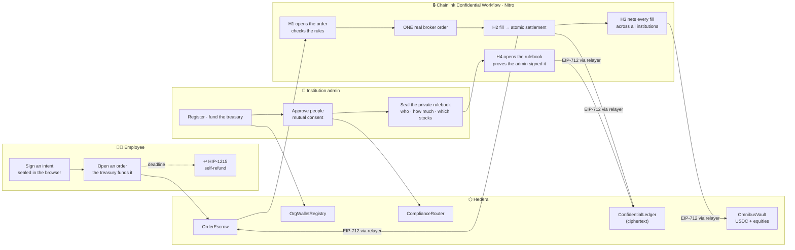

# TradeLayer

**Private trading for institutions.**

An institution funds a treasury, decides who may trade and how much, and its people buy real
equities on its behalf — without publishing what they trade or what they hold.

Orders are sealed in the browser and opened only inside a **Chainlink Confidential Workflow**
running in an AWS Nitro enclave, which checks the institution's private rules, places one real
broker order, and signs the settlement. Positions live encrypted on Hedera in a ledger only their
owner can read. Shares are **ATS equity tokens** pooled in an omnibus vault. Unfilled orders refund
themselves through the **Hedera Schedule Service**.

> Not even we can see the order flow.

Built for **ETHOnline 2026** — Hedera *Tokenization of Anything* and Chainlink *Best Confidential
Workflow*. Hedera testnet, real Alpaca broker.

---

## The problem

Blockchains are made of glass. Put an institution's trading on one and you publish its order flow,
its positions and its size — to competitors and to anyone who wants to front-run it. That is not a
tolerable trade-off for a desk; it is a reason not to use the technology at all.

The usual fix is a trusted server that keeps the data private. That just moves the problem: now one
operator sees everything.

---

## Three ideas that make it work

**1. No token of our own.** Settlement is Circle's USDC, used as-is. There is no per-institution
currency and no wrapper, because a labelled balance would publish exactly how much capital each
firm has on the platform. The vault holds **one undifferentiated pool**; who owns what exists only
as ciphertext in `ConfidentialLedger`. The equities are one token per stock, shared by every
institution, minted in **net batches** — so unrelated trades cancel out and no single firm's
activity is separable on-chain.

**2. Authority, not custody.** An employee never holds company money. Opening an order draws from
the institution's pool and every exit path returns it there. Limits live in an encrypted policy
blob and are enforced inside the enclave *before* the order reaches the market — the same shape as
a trading desk's pre-trade risk check, which is how real firms allocate capital: traders get risk
limits, not a wallet.

**3. Membership takes two signatures.** A wallet is bound to an institution only after the wallet
calls `proposeJoin` **and** the admin calls `approveJoin`. Every compliance action routes through
`ComplianceRouter`, which refuses unless the registry says the target belongs to the caller's
institution. That makes "institution B freezes institution A's employee" *impossible*, not merely
discouraged.

---

## How it works



**What an observer sees:** an amount, a deadline, ciphertext version numbers ticking, and per-symbol
share supply moving in batches. Not which stock, not how much, not at what price, not whose.

**Trust model.** The enclave holds the only keys that matter — the intent-decryption key, the ledger
master key, the broker credentials and the settlement signing key — released by the Vault DON only
to an attested enclave. Every state change on Hedera is an EIP-712 struct the enclave signed; a
relayer submits it and the contract recovers the signer. The relayer can censor; it cannot read an
order or forge a settlement. An abandoned order refunds itself with no keeper.

---

## Hedera — Tokenization of Anything

| Requirement | Where |
|---|---|
| Built with **Asset Tokenization Studio** | `FORD-t`, `TSLA-t`, `VOO-t` issued as ATS equities (9 decimals, approval list, internal KYC) |
| Issuance · configuration · lifecycle | ATS issuance → role wiring → mint on fill → net batch burn → compliant transfer |
| **Compliance controls in use** | ATS KYC registry, control list and freeze — all administered through `ComplianceRouter`, which checks `OrgWalletRegistry` first |
| **Scheduled Transactions** | `OrderEscrow.openBuy` registers a **HIP-1215** `scheduleCall` to `refund(orderId)` at expiry — the contract pays, no keeper |
| Enterprise finance application | Institution treasury, per-person private limits, omnibus custody |
| Verified on HashScan | **all five contracts, Sourcify `exact_match`** |

We deliberately issue **no HTS token of our own**. Settlement is Circle's USDC and we hold no keys
over it — compliance belongs on the securities, which is where ATS puts it.

## Chainlink — Best Confidential Workflow

Four handlers, all `handlerInTee` (nitro / us-west-2):

| Handler | Trigger | Inside the enclave |
|---|---|---|
| **H1 intake** | HTTP | opens the sealed intent, verifies the signature, resolves the institution **from the registry, never from the intent**, decrypts the portfolio and the private rules, places **one** broker order, signs `LedgerUpdate` |
| **H2 reconcile** | cron 30 s | polls fills, signs one atomic `Settlement` — shares credited ⇔ escrow released |
| **H3 batch** | cron 5 min | nets every fill per symbol across **all** institutions, signs `AtsMint` / `AtsBurn` |
| **H4 policy** | HTTP | opens the admin's sealed rulebook, proves authorship against `OrgWalletRegistry`, re-encrypts it and signs `PolicyUpdate` |

Sensitive inputs processed only inside the TEE: the sealed order, the sealed rulebook, both
encrypted ledgers, and the Vault DON secrets. Nothing in `handlers.ts` logs a symbol, quantity,
price, balance or rule. Hedera is read by `eth_call` over HTTPS because it is not a CRE chain.

**H1 never trusts `intent.orgId`.** It is user-supplied; the institution comes from the escrow,
which resolved it from the registry at open time. And a policy the enclave cannot decrypt fails
**closed** — rules that cannot be evaluated are never treated as rules that passed.

---

## Live on Hedera testnet

All five verified on HashScan (`exact_match`).

| | Address |
|---|---|
| `OrgWalletRegistry` | [`0xa85a68C09d87189B562864C77BBBbc28110ae6D9`](https://hashscan.io/testnet/contract/0xa85a68C09d87189B562864C77BBBbc28110ae6D9) |
| `ComplianceRouter` | [`0x6b7f8B75120f1F6CaeCc242581cAc99B07d05D3E`](https://hashscan.io/testnet/contract/0x6b7f8B75120f1F6CaeCc242581cAc99B07d05D3E) |
| `OmnibusVault` | [`0xdF6852804c867068271df32a32114c62b322Fed3`](https://hashscan.io/testnet/contract/0xdF6852804c867068271df32a32114c62b322Fed3) |
| `OrderEscrow` | [`0x4F59e014AEDe86A5dcf2422a45cFf82a2fC5eda9`](https://hashscan.io/testnet/contract/0x4F59e014AEDe86A5dcf2422a45cFf82a2fC5eda9) |
| `ConfidentialLedger` | [`0x458B9b009E291c5869E3d3d56709237a42e8d3b5`](https://hashscan.io/testnet/contract/0x458B9b009E291c5869E3d3d56709237a42e8d3b5) |
| `FORD-t` · `TSLA-t` · `VOO-t` | ATS equities, 9 decimals — [`0x3ca9…24ed`](https://hashscan.io/testnet/contract/0x3ca9772d1030cb74fc0b639338241105577524ed) · [`0xd085…3249`](https://hashscan.io/testnet/contract/0xd085bdb088940ece20a7ccfc064deb2824433249) · [`0x4761…766a`](https://hashscan.io/testnet/contract/0x4761355322501c098d3b0dc9b9cbbfc2d77b766a) |
| USDC | Circle native, HTS `0.0.429274` |

**What actually ran**, end to end, on testnet against the live broker:

1. An institution registered itself and was funded with **80 USDC**. The pool is undifferentiated —
   nothing on-chain says whose it is.
2. Its admin admitted a member on all three equities **through `ComplianceRouter`** — the token
   itself now permits them, and no other institution's admin could have done it.
3. The admin sealed a rulebook: 572 bytes of ciphertext in, **222 bytes stored on-chain**, opened
   only inside the enclave, `policy v1`.
4. An employee placed a sealed order. H1 opened it in the TEE, checked the rules, and placed **one
   real order at Alpaca** — `TSLA`, `notional 20`, `status accepted`. The escrow reserved exactly
   20 USDC of the institution's money; the employee's wallet was never touched.
5. H2 reported `pending:accepted` — the US market was closed, so the order is genuinely **queued
   at the broker** rather than faked into a fill.

Same wallet, same second:

```
PUBLIC        omnibus reserve 80.00 USDC, of which 20.00 committed
              → one pool. No public field says which institution owns any of it.
              FORD-t / TSLA-t / VOO-t: supply 0
              ledger entry v1, 399 bytes of ciphertext
              → symbol, quantity, price, position: NOT VISIBLE ANYWHERE ABOVE

PRIVATE       open orders 1 · stranger decrypt correctly rejected
```

---

## Fractional by design

Equities are issued with **9 decimals** and orders are placed by **amount**, not share count —
Alpaca `notional`, minimum $1. "Spend $20 on Tesla" rather than "buy one $365 share".

That is not a workaround for a small testnet treasury. It removes the need to over-reserve against
a moving price, and with it the gapped-fill case where the vault absorbed an overage: `spent` is
simply what the broker charged.

---

## Repository

```
packages/foundry/   OrgWalletRegistry · ComplianceRouter · OmnibusVault · OrderEscrow
                    ConfidentialLedger · EnclaveAuth · mocks · 86 tests
cre/                Chainlink CRE workflow: tradelayer/main.ts + src/{crypto,handlers,…}
backend/            Intake API · relayer · chain narration
packages/nextjs/    Vite + React: onboarding · institution admin · trade · positions
packages/ats/       ATS issuance and role wiring
```

## Run it

Contracts are deployed and wired, and the backend is hosted:

```bash
curl https://tradelayer-backend.onrender.com/health
```

Locally — see **[DEMO.md](DEMO.md)** for the full runbook, **[DEPLOY.md](DEPLOY.md)** for hosting:

```bash
cd backend && npm start     # intake + relayer + chain narration — keep this on screen
yarn start                  # http://localhost:8080
```

## Tests

```bash
cd packages/foundry && forge test        # 86 — incl. 12 proving one institution
                                         # cannot touch another's people
cd cre/tradelayer && bun test            # 13 crypto vectors shared with the browser
cd backend && npx tsc --noEmit
yarn frontend:check-types && yarn frontend:lint && yarn frontend:build
```

---

## Honest limits

- The enclave runs through `cre workflow simulate` — the same compiled WASM, the same handlers —
  because live Confidential Workflow deployment is in private beta. Confidentiality covers data,
  not logic: the workflow code is public.
- TEE trust is hardware-based, not mathematical. We say *hardware-attested* and *trust-minimised*,
  never *trustless*.
- The relayer is a hot key that can only submit enclave-signed structs. It can censor; it cannot
  forge. Every order has an on-chain, self-executing refund that does not depend on it.
- Batching hides individual fills only at volume. The guarantee that holds regardless is *hidden
  until filled*: an order cannot be front-run.
- **The escrow leaks order size.** Locking an exact amount is visible even though the symbol is
  not. Tracked; the fix is a pre-funded float.
- Paper broker. Cash rebalancing between the USDC reserve and the broker is a manual treasury step.

## Roadmap

Sell flow and share withdrawal through ATS Clearing · dividends as an ATS corporate action ·
custom fee schedule on the equities · `SettlementAttestation` on a CRE-supported chain via
`writeReport` · slashable operator bond behind the reserve check.
