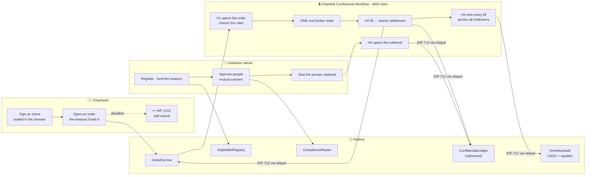

# Overview

## The path of one order

1. **In the browser.** The employee builds an intent, signs it EIP-712, and seals it with ECIES to
   the enclave's public key. `commit = keccak256(ciphertext)` binds the sealed envelope to the
   on-chain order.
2. **On Hedera.** `OrderEscrow.openBuy` draws the amount from `OmnibusVault`, records the order
   with the institution resolved from `OrgWalletRegistry`, and registers a HIP-1215 scheduled
   call to `refund(orderId)` for the deadline.
3. **At the intake API.** The sealed envelope arrives, is persisted before anything else — a crash
   between receipt and trigger must not strand an order — and is handed to the enclave.
4. **Inside the enclave (H1).** Opens the envelope, verifies the signature against the escrow's
   recorded requester, resolves the institution *from the registry*, decrypts the portfolio and the
   rulebook, runs the pre-trade check, and places **one** order at the broker.
5. **Back on Hedera.** The enclave signs a `LedgerUpdate`; the relayer submits it; the encrypted
   position is written.
6. **On fill (H2).** Polls the broker, and on a fill signs one atomic `Settlement` — shares
   credited and escrow released in a single authorization, so they cannot come apart.
7. **On a timer (H3).** Nets every fill per symbol across all institutions and mints or burns the
   difference.

## Component responsibilities

| Where | Component | Responsibility |
|---|---|---|
| Browser | Web app + wallet | builds and signs intents, seals them, decrypts the user's own portfolio |
| Off-chain | Intake API | forwards sealed envelopes; holds no key |
| Off-chain | Relayer | submits enclave-signed authorizations; can censor, cannot forge |
| Chainlink | Workflow DON + Nitro enclave | H1–H4, all `handlerInTee` |
| Chainlink | Vault DON | holds every secret; releases only to an attested enclave |
| Hedera | `OrgWalletRegistry` | which wallet belongs to which institution |
| Hedera | `ComplianceRouter` | holds KYC / control-list / freeze roles on the equities |
| Hedera | `OmnibusVault` | the pooled USDC reserve and every equity |
| Hedera | `OrderEscrow` | the order state machine |
| Hedera | `ConfidentialLedger` | the only place any balance or rule exists, encrypted |
| Hedera (ATS) | equity tokens | one per symbol, shared across institutions |
| Alpaca | Broker | real execution and custody of the backing shares |

## Repository layout

| Path | Manager | Contents |
|---|---|---|
| `packages/foundry` | yarn workspace | Solidity, Foundry tests, deploy scripts |
| `packages/nextjs` | yarn workspace | Vite + React web app (the directory name is Scaffold-ETH legacy) |
| `packages/ats` | yarn workspace | ATS equity issuance and role wiring |
| `backend/` | npm | intake API, relayer, chain narration |
| `cre/` | bun | the Chainlink CRE TypeScript workflow |

Hedera is read by `eth_call` over HTTPS rather than through a CRE EVM client, because Hedera is
not a CRE-supported chain.
